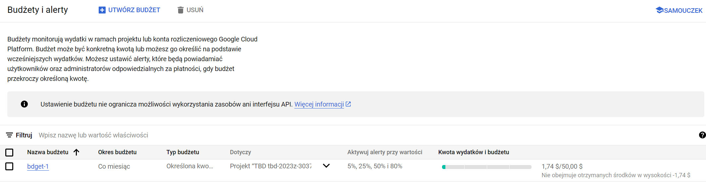
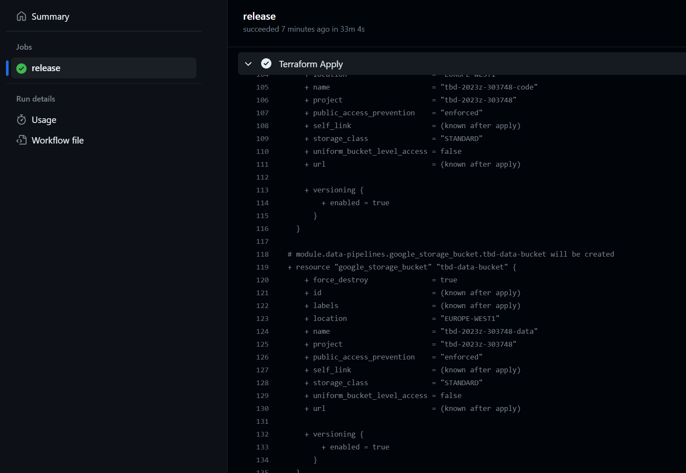
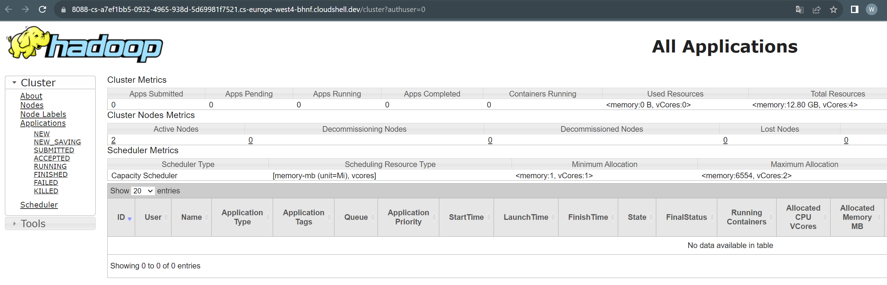

IMPORTANT ❗ ❗ ❗ Please remember to destroy all the resources after each work session. You can recreate infrastructure by creating new PR and merging it to master.
  


1. Authors:

   **Grupa nr 7**
   
   * Wojciech Gierulski
   * Karol Kociołek
   * Jakub Płudowski

   **[link to forked repo](https://github.com/WojciechGierulski/tbd-2023z-phase1)**
   
3. Fork https://github.com/bdg-tbd/tbd-2023z-phase1 and follow all steps in README.md.

4. Select your project and set budget alerts on 5%, 25%, 50%, 80% of 50$ (in cloud console -> billing -> budget & alerts -> create buget; unclick discounts and promotions&others while creating budget).

  

4. From avaialble Github Actions select and run destroy on main branch.


5. Create new git branch and add two resources in ```/modules/data-pipeline/main.tf```:
    1. resource "google_storage_bucket" "tbd-data-bucket" -> the bucket to store data. Set the following properties:
        * project  // look for variable in variables.tf
        * name  // look for variable in variables.tf
        * location // look for variable in variables.tf
        * uniform_bucket_level_access = false #tfsec:ignore:google-storage-enable-ubla
        * force_destroy               = true
        * public_access_prevention    = "enforced"
        * if checkcov returns error, add other properties if needed
       
    2. resource "google_storage_bucket_iam_member" "tbd-data-bucket-iam-editor" -> assign role storage.objectUser to data service account. Set the following properties:
        * bucket // refere to bucket name from tbd-data-bucket
        * role   // follow the instruction above
        * member = "serviceAccount:${var.data_service_account}"

    ***insert the link to the modified file and terraform snippet here***
    
    [link to modified file](modules/data-pipeline/main.tf)
    ```terraform
    resource "google_storage_bucket" "tbd-data-bucket" {
    project                     = var.project_name
    name                        = var.data_bucket_name
    location                    = var.region
    uniform_bucket_level_access = false #tfsec:ignore:google-storage-enable-ubla
    public_access_prevention    = "enforced"
    force_destroy               = true
    versioning {
        enabled = true
        }
    }


    resource "google_storage_bucket_iam_member" "tbd-data-bucket-iam-editor" {
    bucket = google_storage_bucket.tbd-data-bucket.name
    role   = "roles/storage.objectUser"
    member = "serviceAccount:${var.data_service_account}"
    }
    ```

    Create PR from this branch to **YOUR** master and merge it to make new release. 
    
    ***place the screenshot from GA after succesfull application of release with this changes***
    
    

6. Analyze terraform code. Play with terraform plan, terraform graph to investigate different modules.

    ***describe one selected module and put the output of terraform graph for this module here***

    Module: **data-pipeline**

    Overall, this module establishes buckets, permissions for their usage, and manages data within these buckets.

    Description of components in mian.tf:

    1. **locals**
        Local variables for configuring resources.

    2. **job-code, dag-code**
        Definition of Python files containing job code (spark-job.py) and DAG code (dag-code.py).

    3. **tbd-code-bucket, tbd-data-bucket**
        Definition of GCP Buckets:
        
        * tdb-code-bucket: Bucket designated for storing code related to Spark jobs (spark-job.py).
        * tbd-data-bucket: Bucket designated for storing Apache Airflow data.

    4. **tbd-code-bucket-iam-viewer, tbd-data-bucket-iam-editor**
        The data service account is granted storage object user and viewer permissions on buckets defined within this module.
    

    `terraform graph | dot -Tsvg > graph.svg`
    
   
7. Reach YARN UI
   
   ***place the port and the screenshot of YARN UI here***

    **port: 8088**
   
   
8. Draw an architecture diagram (e.g. in draw.io) that includes:
    1. VPC topology with service assignment to subnets
    2. Description of the components of service accounts
    3. List of buckets for disposal
    4. Description of network communication (ports, why it is necessary to specify the host for the driver) of Apache Spark running from Vertex AI Workbech
  
    ***place your diagram here***

9. Add costs by entering the expected consumption into Infracost

   ***place the expected consumption you entered here***
   [expected consumption file](./infracost-usage.yml)
   ```yaml
    version: 0.1
    resource_type_default_usage:
    #
    # The following usage values apply to each resource of the given type, which is useful when you want to define defaults.
    # All values are commented-out, you can uncomment resource types and customize as needed.
    #
    google_compute_router_nat:
        assigned_vms: 1 # Number of VM instances assigned to the NAT gateway
        monthly_data_processed_gb: 3.0 # Monthly data processed (ingress and egress) by the NAT gateway in GB
    google_container_registry:
        storage_gb: 10 # Total size of bucket in GB.
        monthly_class_a_operations: 10 # Monthly number of class A operations (object adds, bucket/object list).
        monthly_class_b_operations: 100 # Monthly number of class B operations (object gets, retrieve bucket/object metadata).
        monthly_data_retrieval_gb: 20.0 # Monthly amount of data retrieved in GB.
        monthly_egress_data_transfer_gb:
        same_continent: 20.0 # Same continent.
        worldwide: 0.0 # Worldwide excluding Asia, Australia.
        asia: 0.0 # Asia excluding China, but including Hong Kong.
        china: 0.0 # China excluding Hong Kong.
        australia: 0.0 # Australia.
    google_storage_bucket:
        storage_gb: 5.0 # Total size of bucket in GB.
        monthly_class_a_operations: 100 # Monthly number of class A operations (object adds, bucket/object list).
        monthly_class_b_operations: 1000 # Monthly number of class B operations (object gets, retrieve bucket/object metadata).
        monthly_data_retrieval_gb: 20.0 # Monthly amount of data retrieved in GB.
        monthly_egress_data_transfer_gb:
        same_continent: 20.0 # Same continent.
        worldwide: 0.0 # Worldwide excluding Asia, Australia.
        asia: 0.0 # Asia excluding China, but including Hong Kong.
        china: 0.0 # China excluding Hong Kong.
        australia: 0.0 # Australia.
   ```

   ***place the screenshot from infracost output here***
   ```
    infracost breakdown --path . --usage-file infracost-usage.yml
    Evaluating Terraform directory at .
    ✔ Downloading Terraform modules
    ✔ Evaluating Terraform directory 
    Warning: Input values were not provided for following Terraform variables: "variable.project_name", "variable.ai_notebook_instance_owner". Use --terraform-var-file or --terraform-var to specify them.
    ✔ Retrieving cloud prices to calculate costs 

    Project: WojciechGierulski/tbd-2023z-phase1

    Name                                                                                Monthly Qty  Unit             Monthly Cost 
                                                                                                                                    
    module.data-pipelines.google_storage_bucket.tbd-code-bucket                                                                    
    ├─ Storage (standard)                                                                         5  GiB                     $0.10 
    ├─ Object adds, bucket/object list (class A)                                               0.01  10k operations          $0.00 
    ├─ Object gets, retrieve bucket/object metadata (class B)                                   0.1  10k operations          $0.00 
    └─ Network egress                                                                                                              
        ├─ Data transfer in same continent                                                        20  GB                      $0.40 
        ├─ Data transfer to worldwide excluding Asia, Australia (first 1TB)            Monthly cost depends on usage: $0.12 per GB  
        ├─ Data transfer to Asia excluding China, but including Hong Kong (first 1TB)  Monthly cost depends on usage: $0.12 per GB  
        ├─ Data transfer to China excluding Hong Kong (first 1TB)                      Monthly cost depends on usage: $0.23 per GB  
        └─ Data transfer to Australia (first 1TB)                                      Monthly cost depends on usage: $0.19 per GB  
                                                                                                                                    
    module.data-pipelines.google_storage_bucket.tbd-data-bucket                                                                    
    ├─ Storage (standard)                                                                         5  GiB                     $0.10 
    ├─ Object adds, bucket/object list (class A)                                               0.01  10k operations          $0.00 
    ├─ Object gets, retrieve bucket/object metadata (class B)                                   0.1  10k operations          $0.00 
    └─ Network egress                                                                                                              
        ├─ Data transfer in same continent                                                        20  GB                      $0.40 
        ├─ Data transfer to worldwide excluding Asia, Australia (first 1TB)            Monthly cost depends on usage: $0.12 per GB  
        ├─ Data transfer to Asia excluding China, but including Hong Kong (first 1TB)  Monthly cost depends on usage: $0.12 per GB  
        ├─ Data transfer to China excluding Hong Kong (first 1TB)                      Monthly cost depends on usage: $0.23 per GB  
        └─ Data transfer to Australia (first 1TB)                                      Monthly cost depends on usage: $0.19 per GB  
                                                                                                                                    
    module.gcr.google_container_registry.registry                                                                                  
    ├─ Storage (standard)                                                                        10  GiB                     $0.26 
    ├─ Object adds, bucket/object list (class A)                                              0.001  10k operations          $0.00 
    ├─ Object gets, retrieve bucket/object metadata (class B)                                  0.01  10k operations          $0.00 
    └─ Network egress                                                                                                              
        ├─ Data transfer in same continent                                                        20  GB                      $0.40 
        ├─ Data transfer to worldwide excluding Asia, Australia (first 1TB)            Monthly cost depends on usage: $0.12 per GB  
        ├─ Data transfer to Asia excluding China, but including Hong Kong (first 1TB)  Monthly cost depends on usage: $0.12 per GB  
        ├─ Data transfer to China excluding Hong Kong (first 1TB)                      Monthly cost depends on usage: $0.23 per GB  
        └─ Data transfer to Australia (first 1TB)                                      Monthly cost depends on usage: $0.19 per GB  
                                                                                                                                    
    module.vertex_ai_workbench.google_storage_bucket.notebook-conf-bucket                                                          
    ├─ Storage (standard)                                                                         5  GiB                     $0.10 
    ├─ Object adds, bucket/object list (class A)                                               0.01  10k operations          $0.00 
    ├─ Object gets, retrieve bucket/object metadata (class B)                                   0.1  10k operations          $0.00 
    └─ Network egress                                                                                                              
        ├─ Data transfer in same continent                                                        20  GB                      $0.40 
        ├─ Data transfer to worldwide excluding Asia, Australia (first 1TB)            Monthly cost depends on usage: $0.12 per GB  
        ├─ Data transfer to Asia excluding China, but including Hong Kong (first 1TB)  Monthly cost depends on usage: $0.12 per GB  
        ├─ Data transfer to China excluding Hong Kong (first 1TB)                      Monthly cost depends on usage: $0.23 per GB  
        └─ Data transfer to Australia (first 1TB)                                      Monthly cost depends on usage: $0.19 per GB  
                                                                                                                                    
    module.vpc.module.cloud-router.google_compute_router_nat.nats["nat-gateway"]                                                   
    ├─ Assigned VMs (first 32)                                                                  730  VM-hours                $1.02 
    └─ Data processed                                                                             3  GB                      $0.14 
                                                                                                                                    
    OVERALL TOTAL                                                                                                            $3.32 
    ──────────────────────────────────
    31 cloud resources were detected:
    ∙ 5 were estimated, all of which include usage-based costs, see https://infracost.io/usage-file
    ∙ 23 were free, rerun with --show-skipped to see details
    ∙ 3 are not supported yet, rerun with --show-skipped to see details

    ┏━━━━━━━━━━━━━━━━━━━━━━━━━━━━━━━━━━━━━━━━━━━━━━━━━━━━┳━━━━━━━━━━━━━━┓
    ┃ Project                                            ┃ Monthly cost ┃
    ┣━━━━━━━━━━━━━━━━━━━━━━━━━━━━━━━━━━━━━━━━━━━━━━━━━━━━╋━━━━━━━━━━━━━━┫
    ┃ WojciechGierulski/tbd-2023z-phase1                 ┃ $3           ┃
    ┗━━━━━━━━━━━━━━━━━━━━━━━━━━━━━━━━━━━━━━━━━━━━━━━━━━━━┻━━━━━━━━━━━━━━┛
   ```

10. Some resources are not supported by infracost yet. Estimate manually total costs of infrastructure based on pricing costs for region used in the project. Include costs of cloud composer, dataproc and AI vertex workbanch and them to infracost estimation.

    ***place your estimation and references here***

    ***what are the options for cost optimization?***
    
12. Create a BigQuery dataset and an external table
    
    ***place the code and output here***
   
    ***why does ORC not require a table schema?***
  
13. Start an interactive session from Vertex AI workbench (steps 7-9 in README):

    ***place the screenshot of notebook here***
   
14. Find and correct the error in spark-job.py

    ***describe the cause and how to find the error***

15. Additional tasks using Terraform:

    1. Add support for arbitrary machine types and worker nodes for a Dataproc cluster and JupyterLab instance

    ***place the link to the modified file and inserted terraform code***
    
    3. Add support for preemptible/spot instances in a Dataproc cluster

    ***place the link to the modified file and inserted terraform code***
    
    3. Perform additional hardening of Jupyterlab environment, i.e. disable sudo access and enable secure boot
    
    ***place the link to the modified file and inserted terraform code***

    4. (Optional) Get access to Apache Spark WebUI

    ***place the link to the modified file and inserted terraform code***
